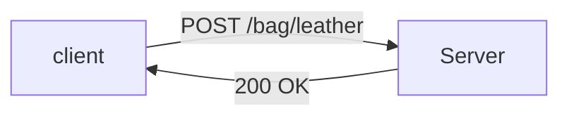
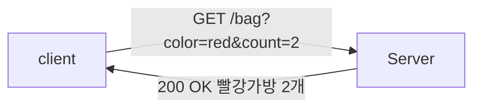

# WIL2

# HTTP에 대해 정리하라

### HTTP 요청

- **HTTP(Hyper Text Transfer Protocol)**

: 현실세계에서의 인터넷에서 데이터를 주고 받는 표준

이 표준 역시 지켜야할 규칙이 있다

GET /bag?color=red&count=2
Host: [spring.com:3000](http://spring.com:3000/)

위와 같이 "빨간색 가방 2개를 내놓아라"라는 HTTP 요청을 예시로 들었을때, 

**GET** /bag?color=red&count=2
Host: [spring.com:3000](http://spring.com:3000/)

**GET은** HTTP 요청을 받는 컴퓨터에게 요청하는 행위이다 (데이터를 달라)

GET /bag?color=red&count=2
**Host: [spring.com:3000](http://spring.com:3000/)**

**Host: [spring.com:3000](http://spring.com:3000/)은** HTTP 요청을 받을 컴퓨터와 프로그램 정보를 뜻한

GET **/bag**?color=red&count=2
Host: [spring.com:3000](http://spring.com:3000/)

**/bag은** HTTP 요청을 받는 컴퓨터에게 원하는 자원을 의미한다, PATH라고 부르기도 한다

GET **/bag**?**color=red&count=2**
Host: [spring.com:3000](http://spring.com:3000/)

 **color=red&count=2**는 원하는 세부조건 (Query) 을 뜻한다.

- **다양한 HTTP Method**
    - `GET` : 데이터를 달라, 퀄리
    - `POST` : 데이터를 저장하라, 바디
    - `PUT` : 데이터를 수정하라, 바디
    - `DELETE` : 데이터를 삭제하라, 쿼리

- **HTTP 요청 구조**

| 첫째줄 - 메소드 패스 쿼리 + HTTP 버전 | POST /bag/leather |
| --- | --- |
| 여러줄 - 헤더 | Host: http://spring.com:3000/ |
| 한줄 띄기 |  |
| 여러줄 - 바디 | 가방 가죽 정보 |

- **URL (Uniform Resource Locator)**

   http://spring.com:3000/bag?color=red&count=2

위와 같이, 흔히 우리가 네이버나 구글 같은 사이트에 들어가면 보이는 주소창이 URL이다. 이 URL을 하나하나 뜯어서 살펴보자.

1. 가장 앞에 있는 **HTTP**는 사용하고 있는 **약속 프로토콜**을 의미한다

   **http**://spring.com:3000/bag?color=red&count=2

1. spring.com은 **도메인 이름**, **:** 다음으로 나오는 숫자 3000은 **포트번호**를 의미한다. 도메인 이름은 IP로 대체 가능하다

   http://**spring.com:3000**/bag?color=red&count=2

1. 다음으로는 **자원의 경로**인 bag

   http://spring.com:3000/**bag**?color=red&count=2

1. 뒷부분에는 구분기호를 포함한 추가적인 정보를 담는 쿼리가 담긴다

   http://spring.com:3000/bag?**color=red&count=2**

**정리**

1. (웹을 통한) 컴퓨터 간의 통신은 **HTTP라는 표준화된 방식**이 있다
2. HTTP 요청은 **HTTP Method** (GET, POST)와 **Path** (/bag)가 핵심이다
3. 요청에서 데이터를 전달하기 위한 2가지 방법은 **쿼리**와 **바디**이다

---

### HTTP 응답

지금까지는 인터넷 상에서 컴퓨터끼리 요청을 어떻게 하는지 알아보았다. 그러면 요청을 받은 쪽에선 답장, 응답을 어떻게 할까?

- **클라이언트 - 서버 구조**

요청에 대한 응답을 제공한 컴퓨터가 서버(Server)이고, 요청을 한 컴퓨터가 고객(Client) 컴퓨터이다

클라이언트는 ‘데이터를 줘’ 혹은 ‘데이터를 저장해’라는 요청을 하고, 서버는 데이터를 주거나 저장시키고 ‘성공했다’라는 응답 또는 데이터를 담아서 반환하게 된다

- **상태코드**

응답에 들어가는 숫자 200은 **상태코드**라고 하며 매우 다양하다

`300` : Moved Permanetly (다른곳으로 옮겨가자)

`404` : NotFound (요청한 것을 찾을 수 없다)

`500` : Internal Server Error (내부에 문제가 생겼다)

이 HTTP 응답에는 Body를 사용해서 추가적인 정보를 담을 수도 있다

예를 들어, 다음과 같이 가방을 달라고 했을때 빨강 가방 2개를 HTTP 응답을 바디에 담아주어서 보낸다고 생각하면 된다

- **HTTP 응답 구조**
    
    HTTP 응답 역시 요청과 구조는 동일하다
    
    | 첫째줄 - 상태코드 | HTTP/1.1 200 OK |
    | --- | --- |
    | 여러줄 - 헤더 | Content-Type: application/json |
    | 한줄 띄기 |  |
    | 여러줄 - 바디 | {  |
    |  |   “name” : ”A”, |
    |  |   “age” : null |
    |  | } |

**정리**

1. HTTP 응답은 **상태 코드**가 핵심이다

# HTTPS가 무엇인지 정리하고, HTTP와 비교하라

- **HTTPS(Hyper Text Transfer Protocol Secure)**

HTTP에 데이터 암호화가 추가된 프로토콜이다. HTTPS는 HTTP와 다르게 443번 포트를 사용하며, 네트워크 상에서 중간에 제3자가 정보를 볼 수 없도록 암호화를 지원하고 있다.

- **대칭키 암호화와 비대칭키 암호화**

HTTPS는 대칭키 암호화 방식과 비대칭키 암호화 방식을 모두 사용하고 있다

- 대칭키 암호화
    - 클라이언트와 서버가 동일한 키를 사용해 암호화/복호화를 진행함
    - 키가 노출되면 매우 위험하지만 연산 속도가 빠름
- 비대칭키 암호화
    - 1개의 쌍으로 구성된 공개키와 개인키를 암호화/복호화 하는데 사용함
    - 키가 노출되어도 비교적 안전하지만 연산 속도가 느림

- **동작 과정**

HTTPS 연결 과정에서는 먼저 서버와 클라이언트 간에 세션키를 교환한다. 데이터 간의 교환에는 빠른 연산 속도가 필요하므로 세션키는 대칭키로 만들어지며, 세션키는 주고 받는 데이터를 암호화하기 위해 사용되는 대칭키이다

- **HTTP와 HTTPS**

HTTP는 암호화가 없기 때문에 보안에 취약한 반면, HTTPS는 보안면에서 안전하게 데이터를 주고받을 수 있다. 하지만 HTTPS는 암호화/복호화의 과정이 필요하기 때문에 HTTP보다 속도가 느리며, 인증서를 발급하고 유지하기 위한 추가 비용이 발생한다.

따라서, 개인 정보와 보안이 필요한 데이터를 주고 받아야 한다면 HTTPS를 이용하고,단순한 정보 조회와 같은 데이터를 처리해야한다면 HTTP를 이용해야한다

# 아래 API에 대한 RESTful한 URI를 설계하라.

| Method | URI | 설명 |
| --- | --- | --- |
| GET | /events | 이벤트 목록 조회  |
| GET | /events/{eventId} | 이벤트 조회 |
| POST | /events/{eventId} | 이벤트 등록 |
| PATCH | /events/{eventId} | 이벤트 수정 |
| PATCH | /events/{eventId}/status | 이벤트 삭제 |
| PATCH | /events/{eventId}/status | 이벤트 상태 변경 |
| GET | /events/{eventId}/orders/{orderId} | 특정 이벤트의 주문 목록 조회 |
| GET | /users | 멤버 목록 조회 |
|  | /users/:{userId}/membership | 특정 멤버 권한 변경 |
| GET | /users/{userId} | 특정 멤버 정보 조회 |
| PATCH | /users/{userId} | 특정 멤버 정보 변경 |
| POST | /users | 멤버 등록  |